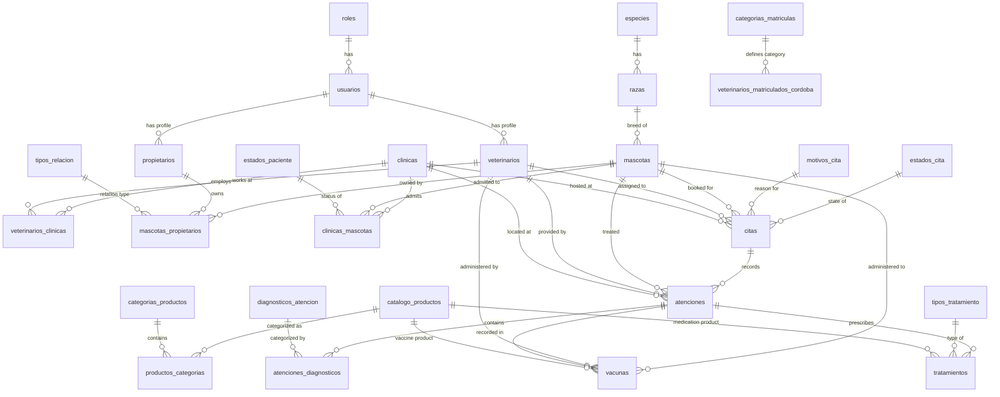

# VetVault System & Application Architecture 🐾

This document provides a comprehensive technical overview of **VetVault**, a pet clinical management and appointment scheduling ecosystem developed for **Prácticas Profesionalizantes I** at the *Instituto Superior Villa del Rosario*.

---

## 1. System Overview

VetVault is structured as a **monorepo** dividing client-side frontends from backend services:

```
proyecto-vet-pp/
├── apps/
│   ├── web-app/             # React (Vite) administration & clinical dashboard
│   └── mobile-app/          # React Native client portal (under construction)
├── services/
│   └── api-backend/         # Fastify (TypeScript) API server & Postgres DB integration
└── SYSTEM_OVERVIEW.md       # [This Document]
```

### Main Use Cases
- **Clinical Recording**: Veterinarians log details of consultations (`atenciones`), prescribe medications (`tratamientos`), and record vaccinations (`vacunas`).
- **Owner Portals**: Pet owners view their pets' digital medical logs, appointment history, and vaccine records.
- **Appointment Scheduling**: Real-time scheduling matching pets, clinics, reasons for appointments, and veterinary doctors.

---

## 2. Technical Stack

### Backend (`services/api-backend`)
- **Runtime & Language**: Node.js & TypeScript
- **Web Framework**: [Fastify](https://fastify.dev/) (known for low overhead and high performance)
- **Database ORM**: [Drizzle ORM](https://orm.drizzle.team/) (lightweight, type-safe SQL query builder)
- **Database**: PostgreSQL (Prisma database instance)
- **Authentication**: JWT (JSON Web Tokens) via `@fastify/cookie` + Bcrypt for password hashing
- **Documentation**: Swagger UI (`@fastify/swagger` + `@fastify/swagger-ui`) for automatic API endpoint documentation

### Web Frontend (`apps/web-app`)
- **Runtime & Tooling**: Node.js, Vite (bundler), TypeScript
- **Framework**: [React](https://react.dev/)
- **Routing**: React Router v7 (`react-router-dom`)
- **Styling**: Modern Vanilla CSS with a dynamic theme engine (using CSS custom properties for light/dark modes and role-based accent styling like `.role-vet` and `.role-owner` for tailored experiences)
- **Icons**: Lucide React (`lucide-react`)

---

## 3. Database Schema & Data Model

The database is powered by PostgreSQL. Tables and relationships are defined via Drizzle ORM in [schema.ts](file:///home/rei/VetVault/proyecto-vet-pp/services/api-backend/src/db/schema.ts).

### Relationship Diagram



### Primary Tables & Fields

1. **`usuarios`**: Core security account credentials.
   - `id` (UUID, primary key)
   - `email` (Varchar, unique)
   - `password_hash` (Varchar)
   - `rol_id` (Integer referencing `roles.id`)
   - `fecha_creacion` (Timestamp)

2. **`veterinarios`**: Profile details for veterinary doctors.
   - `id` (UUID, primary key)
   - `usuario_id` (UUID referencing `usuarios.id`)
   - `nombre` / `apellido` (Varchar)
   - `numero_matricula` (Varchar, unique) — verified against Cordoba certified directory
   - `telefono` / `foto_url` (Varchar, optional)

3. **`propietarios`**: Profile details for pet owners (tutores).
   - `id` (UUID, primary key)
   - `usuario_id` (UUID referencing `usuarios.id`)
   - `nombre` / `apellido` (Varchar)
   - `es_empresa` (Boolean) / `razon_social` (Varchar)
   - `telefono` (Varchar) / `direccion` (Varchar, optional)
   - `foto_url` (Varchar, optional)

4. **`clinicas`**: Veterinary centers where treatments and appointments occur.
   - `id` (UUID, primary key)
   - `nombre_comercial` (Varchar)
   - `direccion` (Text, optional)
   - `telefono` (Varchar, optional)

5. **`mascotas`**: Pet medical identifiers and details.
   - `id` (UUID, primary key)
   - `nombre` (Varchar)
   - `fecha_nacimiento` (Timestamp)
   - `raza_id` (Integer referencing `razas.id`)
   - `sexo` (Char: 'M' or 'H')
   - `es_castrado` (Boolean)
   - `numero_microchip` (Varchar, optional)
   - `foto_url` (Varchar, optional)
   - `alergias` / `condiciones_cronicas` / `contraindicaciones` (Text, optional)

6. **`citas`**: Appointments booking matching pets, veterinarians, and clinics.
   - `id` (UUID, primary key)
   - `mascota_id` (UUID referencing `mascotas.id`)
   - `veterinario_id` (UUID referencing `veterinarios.id`, optional)
   - `clinica_id` (UUID referencing `clinicas.id`)
   - `fecha_hora` (Timestamp)
   - `motivo_id` (Integer referencing `motivos_cita.id`)
   - `estado_cita_id` (Integer referencing `estados_cita.id`)

7. **`atenciones`**: Clinic consultation logs.
   - `id` (UUID, primary key)
   - `cita_id` (UUID referencing `citas.id`, optional/unique)
   - `mascota_id` (UUID referencing `mascotas.id`)
   - `veterinario_id` (UUID referencing `veterinarios.id`)
   - `clinica_id` (UUID referencing `clinicas.id`)
   - `notas_clinicas` (Text, optional)
   - `peso_actual` (Decimal, optional)
   - `fecha_atencion` (Timestamp)

8. **`tratamientos`**: Active or past prescriptions.
   - `id` (UUID, primary key)
   - `atencion_id` (UUID referencing `atenciones.id`)
   - `tipo_id` (Integer referencing `tipos_tratamiento.id`)
   - `producto_id` (Integer referencing `catalogo_productos.id`)
   - `dosis` / `frecuencia` (Varchar)
   - `fecha_inicio` (Timestamp)
   - `fecha_fin` (Timestamp, optional)
   - `indicaciones_adicionales` (Text, optional)

9. **`vacunas`**: Pet vaccination schedule and records.
   - `id` (UUID, primary key)
   - `mascota_id` (UUID referencing `mascotas.id`)
   - `veterinario_id` (UUID referencing `veterinarios.id`, optional)
   - `atencion_id` (UUID referencing `atenciones.id`, optional)
   - `producto_id` (Integer referencing `catalogo_productos.id`)
   - `numero_lote` (Varchar, optional)
   - `fecha_aplicacion` (Timestamp)
   - `fecha_proxima_dosis` (Timestamp, optional)

10. **`catalogo_productos`**: Verified product directory matching national authorities (SENASA).
    - `id` (Serial, primary key)
    - `numero_senasa` (Varchar, unique)
    - `nombre_comercial` (Varchar)
    - `nombre_firma` (Varchar)

11. **`veterinarios_matriculados_cordoba`**: Authorized veterinarians list in Córdoba.
    - `id` (Serial, primary key)
    - `nombre_completo` (Varchar)
    - `numero_matricula` (Varchar, unique)
    - `dni` (Varchar, unique)
    - `categoria_id` (Varchar referencing `categorias_matriculas.id`)
    - `es_valido` (Boolean)
    - `actualizado_el` (Timestamp)

12. **`categorias_matriculas`**: Verification categories.
    - `id` (Varchar, primary key)
    - `categoria` (Varchar)
    - `cobertura` (Text)

---

## 4. Key Business Logic

### Veterinarian Matricula Verification
To protect animal safety and comply with regulations, veterinarian sign-up/registration relies on an official directory certification system. 
- **Registry**: `veterinarios_matriculados_cordoba` tracks all authorized professionals in Córdoba.
- **Categorization**: 
  - **Category A**: Active veterinarians in independent/private practice (clinics, surgery). Marked as `es_valido = true`.
  - **Category B**: Veterinarians under public dependency (SENASA, national universities). Marked as `es_valido = false` (cannot execute independent clinical registrations).
  - **Category C**: Restrictive/administrative roles only. Marked as `es_valido = false`.
- **Active Directory Sync**: The Python scraping scripts parse updated PDFs of certified veterinary boards and run [import-vets.ts](file:///home/rei/VetVault/proyecto-vet-pp/services/api-backend/src/db/import-vets.ts) to push these validation statuses.

### User Roles & Authorizations
- **Administrador** (rol_id 1): Complete clinical control, database audits, and systems adjustments.
- **Veterinario** (rol_id 2): Allowed to create clinical consultations (`atenciones`), manage prescriptions (`tratamientos`), log vaccinations (`vacunas`), and update profile records.
- **Propietario** (rol_id 3): Read-only access to their registered pets' history, details of past consults, upcoming appointment calendar, and digital vaccine card.

---

## 5. Web App Navigation & Routing Map

The frontend routing in [router.tsx](file:///home/rei/VetVault/proyecto-vet-pp/apps/web-app/src/router.tsx) is protected by an `AuthGuard` context component, which prevents unauthenticated users from reaching dashboard pages:

```
[root] (/)
 ├── login (Public login view)
 └── [AuthGuard] (Session verified zone)
      └── [AppLayout] (Includes shared Header and Sidebar)
           ├── dashboard (Main overview & quick summaries)
           ├── mascotas (Registered pets view)
           │    └── :id (Detailed medical history of a pet)
           ├── citas (Appointments status tracker)
           └── perfil (Veterinary profile and clinic credentials configuration)
```

---

## 6. How to Run the Ecosystem

### Prerequisites
- **Node.js**: v22+
- **Postgres Database**: Set `DATABASE_URL` in `.env` configurations.

### 1. Launch Backend API
```bash
cd services/api-backend
npm install

# Database Setup Options:
# Option A: Full Database Setup (reset, push schemas, seed master tables, and import vets/products)
npm run db:setup

# Option B (Optional): Populates mock data for local testing
npm run db:seed-mock

# Option C (Manual steps):
# npm run db:reset             # Reset/wipe database
# npm run db:push              # Push Schema changes to PostgreSQL
# npm run db:seed              # Populates roles, breeds, diagnostics, etc.
# npm run db:import-vets       # Imports Cordoba veterinarian directories
# npm run db:import-productos  # Imports SENASA catalog database

npm run dev                    # Starts Fastify server on http://localhost:5000
```

### 2. Launch Frontend Web App
```bash
cd apps/web-app
npm install
npm run dev                    # Starts Vite bundler on http://localhost:5173
```

---
*Created as part of VetVault Project Documentation (2026).*
