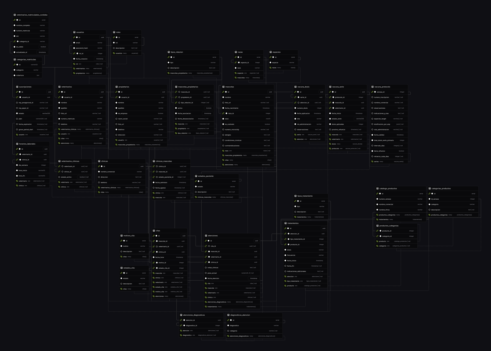

# VetVault API Backend — Esquema de Base de Datos

VetVault utiliza **PostgreSQL** como motor de base de datos relacional, gestionado mediante **Drizzle ORM** para el mapeo de esquemas y consultas seguras en TypeScript.

A continuación, se detalla la estructura lógica de las tablas del sistema agrupadas en módulos funcionales.

---

## 📸 Diagrama de Relaciones (E/R)

---

## 📂 Glosario de Tablas del Sistema

### 1. Autenticación y Cuentas de Usuario

Maneja el acceso, credenciales y perfiles de los tres roles principales del ecosistema:

*   **`roles`**: Contiene los roles de usuario admitidos.
    *   *Campos*: `id` (serial PK), `rol` (varchar, ej. 'Admin', 'Veterinario', 'Propietario'), `descripcion` (text).
*   **`usuarios`**: Cuentas del sistema con credenciales cifradas.
    *   *Campos*: `id` (uuid PK), `email` (varchar), `password_hash` (varchar), `rol_id` (fk -> roles), `fecha_creacion` (timestamp).
*   **`veterinarios`**: Ficha del perfil profesional del médico.
    *   *Campos*: `id` (uuid PK), `usuario_id` (fk -> usuarios), `nombre` (varchar), `apellido` (varchar), `foto_url` (varchar), `numero_matricula` (varchar), `telefono` (varchar).
*   **`propietarios`**: Perfil de tutores y dueños de mascotas.
    *   *Campos*: `id` (uuid PK), `usuario_id` (fk -> usuarios), `nombre` (varchar), `apellido` (varchar), `es_empresa` (boolean), `razon_social` (varchar), `foto_url` (varchar), `telefono` (varchar), `direccion` (varchar).
*   **`veterinarios_clinicas`**: Relación de asignación N:N entre profesionales y sucursales clínicas.
    *   *Campos*: `veterinario_id` (fk -> veterinarios), `clinica_id` (fk -> clinicas), `estado_activo` (boolean).

---

### 2. Clínicas y Agendas

Gestiona las sucursales clínicas y las franjas horarias de atención para cada profesional:

*   **`clinicas`**: Sucursales físicas veterinarias del sistema.
    *   *Campos*: `id` (uuid PK), `nombre_comercial` (varchar), `direccion` (text), `telefono` (varchar).
*   **`horarios_laborales`**: Grilla horaria de atención asignada a un veterinario por clínica.
    *   *Campos*: `id` (uuid PK), `veterinario_id` (fk -> veterinarios), `clinica_id` (fk -> clinicas), `dia_semana` (integer, 0-6), `hora_inicio` (varchar "HH:MM"), `hora_fin` (varchar "HH:MM").

---

### 3. Pacientes y Tutores (Mascotas)

Administra las fichas de los animales, clasificaciones biológicas e ingresos clínicos:

*   **`especies`**: Listado de especies animales (Canino, Felino, etc.).
    *   *Campos*: `id` (serial PK), `especie` (varchar).
*   **`razas`**: Razas de animales asociadas a sus especies correspondientes.
    *   *Campos*: `id` (serial PK), `especie_id` (fk -> especies), `raza` (varchar).
*   **`mascotas`**: Ficha clínica del animal paciente.
    *   *Campos*: `id` (uuid PK), `nombre` (varchar), `foto_url` (varchar), `fecha_nacimiento` (timestamp), `raza_id` (fk -> razas), `sexo` (char 'M'/'H'), `es_castrado` (boolean), `numero_microchip` (varchar), `alergias` (text), `condiciones_cronicas` (text), `contraindicaciones` (text).
*   **`mascotas_propietarios`**: Relación N:N de tenencia/tutela entre animales y personas.
    *   *Campos*: `mascota_id` (fk -> mascotas), `propietario_id` (fk -> propietarios), `tipo_relacion_id` (fk -> tipos_relacion), `activo` (boolean), `fecha_asociacion` (timestamp), `fecha_desasociacion` (timestamp).
*   **`tipos_relacion`**: Tipos de tutela (ej. 'Tutor Principal', 'Co-propietario', 'Cuidador').
    *   *Campos*: `id` (serial PK), `tipo` (varchar), `descripcion` (text).
*   **`clinicas_mascotas`**: Admisión clínica del paciente en una sucursal veterinaria.
    *   *Campos*: `clinica_id` (fk -> clinicas), `mascota_id` (fk -> mascotas), `estado_paciente_id` (fk -> estados_paciente), `fecha_asociacion` (timestamp), `fecha_desasociacion` (timestamp).
*   **`estados_paciente`**: Estados de admisión del animal en la veterinaria (Pre-registrado, Activo, Inactivo).
    *   *Campos*: `id` (serial PK), `estado` (varchar), `descripcion` (text).

---

### 4. Turnos (Agenda de Citas)

Controla la reserva y estados de las visitas programadas:

*   **`citas`**: Registro de turnos agendados por los tutores.
    *   *Campos*: `id` (uuid PK), `mascota_id` (fk -> mascotas), `veterinario_id` (fk -> veterinarios), `clinica_id` (fk -> clinicas), `fecha_hora` (timestamp), `motivo_id` (fk -> motivos_cita), `estado_cita_id` (fk -> estados_cita).
*   **`estados_cita`**: Estados de control del turno (Agendada, Confirmada, Cancelada, Completada).
    *   *Campos*: `id` (serial PK), `estado` (varchar), `descripcion` (text).
*   **`motivos_cita`**: Motivo del turno (Consulta General, Urgencia, Cirugía, Control).
    *   *Campos*: `id` (serial PK), `motivo` (varchar), `descripcion` (text).

---

### 5. Atenciones Clínicas (Consultas)

Registra la evolución médica y el examen físico del paciente durante una consulta presencial:

*   **`atenciones`**: Consulta clínica efectuada por el profesional veterinario.
    *   *Campos*: `id` (uuid PK), `cita_id` (fk -> citas, nullable), `mascota_id` (fk -> mascotas), `veterinario_id` (fk -> veterinarios), `clinica_id` (fk -> clinicas), `notas_clinicas` (text), `peso_actual` (decimal), `fecha_atencion` (timestamp).
*   **`diagnosticos_atencion`**: Catálogo interno de diagnósticos posibles.
    *   *Campos*: `id` (serial PK), `diagnostico` (varchar), `categoria` (varchar).
*   **`atenciones_diagnosticos`**: Relación N:N que asocia uno o más diagnósticos a una consulta clínica.
    *   *Campos*: `atencion_id` (fk -> atenciones), `diagnostico_id` (fk -> diagnosticos_atencion).

---

### 6. Tratamientos y Fármacos (Vademécum)

Maneja las recetas clínicas indicadas por el veterinario cruzadas con el catálogo oficial:

*   **`catalogo_productos`**: Listado de medicamentos y vacunas autorizados por SENASA.
    *   *Campos*: `id` (serial PK), `numero_senasa` (varchar), `nombre_comercial` (varchar), `nombre_firma` (varchar).
*   **`categorias_productos`**: Categorías terapéuticas oficiales de SENASA.
    *   *Campos*: `id` (serial PK), `id_senasa` (integer), `categoria` (varchar), `descripcion` (text).
*   **`productos_categorias`**: Relación N:N de categorías para cada fármaco.
    *   *Campos*: `producto_id` (fk -> catalogo_productos), `categoria_id` (fk -> categorias_productos).
*   **`tratamientos`**: Recetas de medicamentos y dosificaciones prescritas en una atención.
    *   *Campos*: `id` (uuid PK), `atencion_id` (fk -> atenciones), `tipo_id` (fk -> tipos_tratamiento), `producto_id` (fk -> catalogo_productos), `dosis` (varchar), `frecuencia` (varchar), `fecha_inicio` (timestamp), `fecha_fin` (timestamp), `indicaciones_adicionales` (text).
*   **`tipos_tratamiento`**: Categorías de prescripción (Medicamento, Dieta, Cirugía, Fisioterapia, etc.).
    *   *Campos*: `id` (serial PK), `tipo` (varchar), `descripcion` (text).

---

### 7. Carnet de Vacunación y Protocolos

Lleva el control de series de vacunas primarias, intervalos y alarmas de refuerzo:

*   **`vacuna_protocolo`**: Esquema de dosificación y periodicidad oficial para cada vacuna del SENASA.
    *   *Campos*: `senasa_id` (PK fk -> catalogo_productos), `numero_inscripcion` (varchar), `nombre_comercial` (varchar), `observaciones` (text), `indicaciones_y_vias` (text), `especies_target` (varchar array), `dosificacion_por_esp` (jsonb), `vias_administracion` (varchar array), `fecha_validez` (timestamp), `total_dosis_serie_primaria` (integer), `intervalo_dias` (integer array), `tiene_refuerzo` (boolean), `refuerzo_cada_dias` (integer).
*   **`vacuna_serie`**: Serie de inmunización activa abierta para una mascota y una vacuna específica.
    *   *Campos*: `id` (uuid PK), `protocolo_id` (fk -> vacuna_protocolo), `mascota_id` (fk -> mascotas), `veterinario_id` (fk -> veterinarios), `fecha_inicio` (timestamp), `estado_serie` (varchar 'en_curso'/'completada'), `dosis_aplicadas` (integer), `proximo_refuerzo` (timestamp).
*   **`vacuna_dosis`**: Aplicación de dosis individuales de vacunas.
    *   *Campos*: `id` (uuid PK), `serie_id` (fk -> vacuna_serie), `atencion_id` (fk -> atenciones, nullable), `numero_dosis` (integer), `fecha_aplicacion` (timestamp), `lote` (varchar), `via_administracion` (varchar), `observaciones` (text).

---

### 8. Planes de Pago (Suscripciones)

Controla los planes de facturación mediante pasarela para clínicas y profesionales:

*   **`suscripciones`**: Estado financiero de las suscripciones a planes premium de VetVault.
    *   *Campos*: `id` (uuid PK), `usuario_id` (fk -> usuarios), `mp_preapproval_id` (varchar, ID de suscripción de Mercado Pago), `mp_payer_id` (varchar), `estado` (varchar, ej. 'activo', 'impago', 'cancelado', 'inactivo'), `plan` (varchar, ej. 'independent', 'clinic_pro'), `fecha_expiracion` (timestamp), `grace_period_start` (timestamp).

---

### 9. Auditoría e Inteligencia Artificial

Registra el comportamiento y llamadas de herramientas clínicas de la IA para analíticas y seguridad:

*   **`audit_log`**: Historial de tool calls invocadas por el agente de Inteligencia Artificial.
    *   *Campos*: `id` (uuid PK), `user_id` (uuid), `user_rol` (varchar), `tool` (varchar), `args` (jsonb), `timestamp` (timestamp).

---

### 10. Validaciones de Organismos Externos (Matrículas)

Padrón local importado para verificar la legitimidad de las matrículas profesionales en tiempo real:

*   **`veterinarios_matriculados_cordoba`**: Listado de profesionales inscriptos del Colegio de Veterinarios de Córdoba.
    *   *Campos*: `id` (serial PK), `nombre_completo` (varchar), `numero_matricula` (varchar), `dni` (varchar), `categoria_id` (fk -> categorias_matriculas), `es_valido` (boolean), `actualizado_el` (timestamp).
*   **`categorias_matriculas`**: Categorías profesionales (ej. 'A' para ejercicio clínico habilitado, 'B' y 'C' para áreas administrativas o pasivas).
    *   *Campos*: `id` (varchar PK), `categoria` (varchar), `cobertura` (text).
